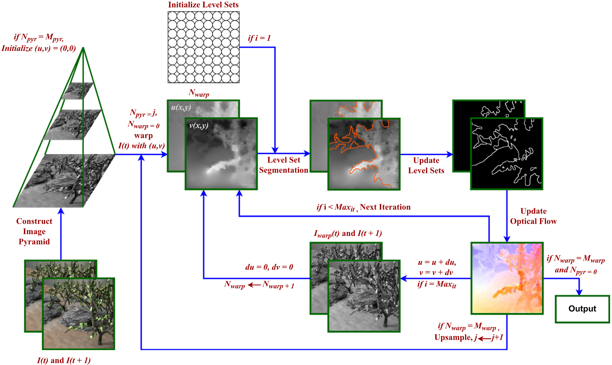

# A Level Set Based Fractional Order Variational Model for Motion Estimation in Application Oriented Spectrum

**Authors:** Muzammil Khan, Pushpendra Kumar  

## 📄 [Read the Full Article](https://www.sciencedirect.com/science/article/pii/S095741742300129X)

## Abstract  
<p align="justify">
In recent years, motion estimation has become prominent in the field of computer vision. This is due to its
applications in various domains such as object detection, video surveillance, undersea navigation, fire damage
control, particle image velocimetry etc. Therefore, in this paper, a nonlinear fractional order variational model
is introduced for motion estimation in an image sequence (video).
</p>
<p align="justify">
The motion estimation is performed in terms of optical flow. The objective of this work is to generalize the existing variational models from integer order to
fractional order and provide the increased robustness against outliers, and furnish the dense and discontinuity
preserving optical flow in various spectra such as synthetic, sintell, thermal, underwater, medical, fire and
smoke and fluid image sequences. For this purpose, a level set segmentation based fractional order variational
functional composed of a non-quadratic Charbonnier norm and a regularization term is propounded. This nonquadratic penalty provides an effective robustness against outliers, whereas the fractional derivative possesses a
non-local character, and therefore is capable to deal with discontinuous information about texture and edges.
The level set segmentation is performed on the flow field instead of images, which is a union of disjoint
and independently moving regions such that each motion region contains objects of equal flow velocity. The
numerical discretization of the fractional partial differential equations is employed with the help of Grünwald–
Letnikov fractional derivative. The resulting nonlinear formulation is converted into a linear system and solved
by an efficient numerical technique. The experimental results are carried out on 10 different application
oriented spectra.
</p>
<p align="justify">
The performance of the model is tested using different error measures and demonstrated
against several outliers. The efficiency and accuracy of the proposed model is shown against recently published
works. The graphical abstract for this algorithm is illustrated under the next section.
</p>

## Figure  

**Figure 1:** Proposed NFVLS algorithm in optical flow estimation.

---

## Contact
For any questions or collaboration opportunities, reach out to:
- **Muzammil Khan** (Corresponding Author) – [m.khan@utwente.nl](mailto:m.khan@utwente.nl)

---
## Citation

If you use our code in your research, please consider citing our work using the following BibTeX entry:

```bibtex
@article{khan2023level,
  title={A level set based fractional order variational model for motion estimation in application oriented spectrum},
  author={Khan, Muzammil and Kumar, Pushpendra},
  journal={Expert Systems with Applications},
  volume={219},
  pages={119628},
  year={2023},
  publisher={Elsevier}
}
